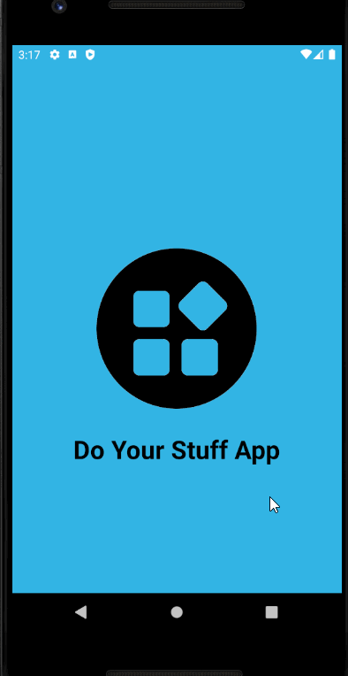

# MyPracticeToDoApp
This repository was created so that I may learn more about android developent before the Code Path course starts for Spring 2021 Semester

I wanted to get a headstart as creating the required To Do app sparked an interest in creating android applications

## Current Progress: 01/08/2021

So far I have implemented a splash screen, and created most of the UI.
I am missing the add, remove, and edit functions.
Most of the classes has been implemented, but User doesn't have access to it just yet
